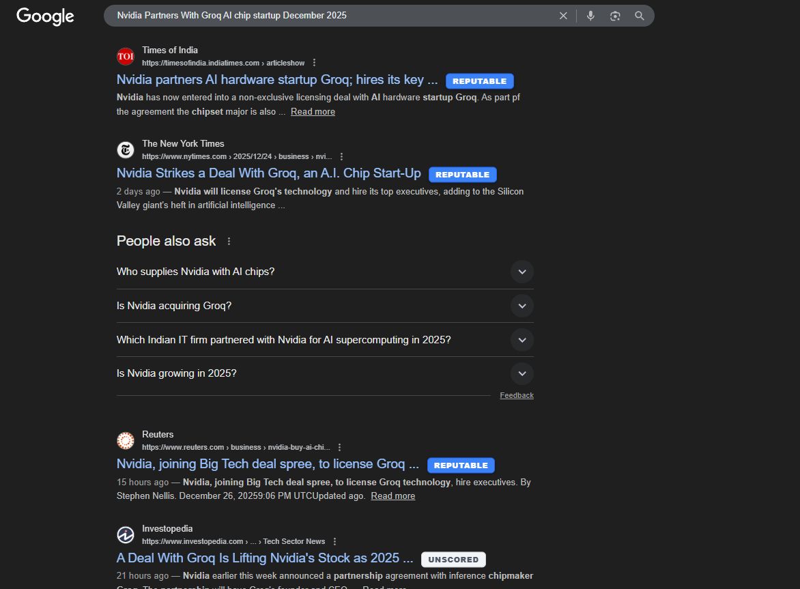
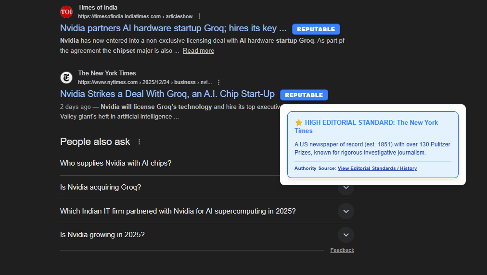
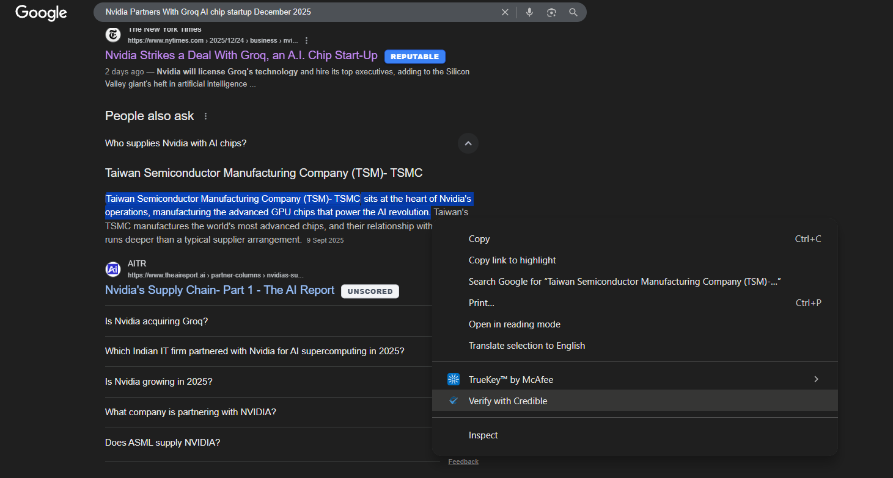
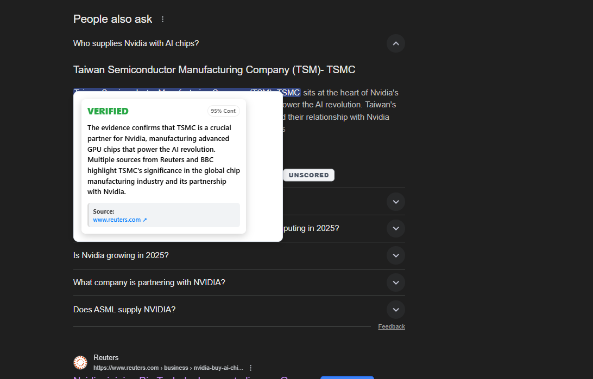
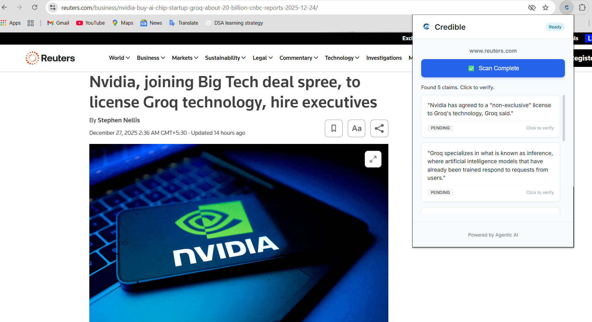
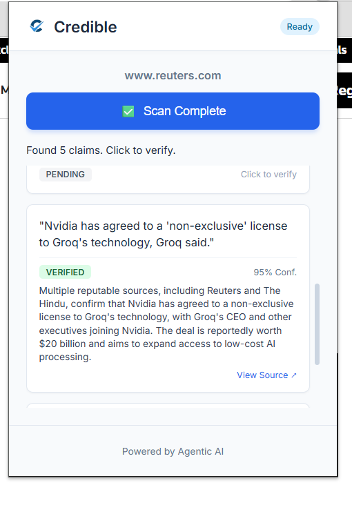

<div align="center">
  <a href="https://credible-website.vercel.app/">
    
  </a>

  <h1 align="center">Credible: Agentic Fact-Checker</h1>

  <p align="center">
    <strong>Real-time credibility signals for the modern web.</strong><br>
    Powered by Agentic AI (Llama-3 + Groq + Tavily).
  </p>

  <p align="center">
    <a href="https://microsoftedge.microsoft.com/addons/detail/credible-agentic-factch/glhckknhelfandbhbibnmdkpebacokpk">
      
    </a>
    <a href="https://credible-website.vercel.app/">
      
    </a>
    <a href="LICENSE">
      
    </a>
    
  </p>
  
  <br>
</div>

## 🕵️‍♂️ About The Project

**Credible** is not just a bias blocker—it is an autonomous AI agent that lives in your browser.

While you browse, Credible's "Fast Brain" scans search results and headlines for misinformation. When you need deep verification, its "Slow Brain" (Agentic Workflow) actively researches claims, cross-references government data, and provides citations—all without you leaving the tab.

---

## 📸 Gallery

<div align="center">
  
  
  
  <br><br>
  
  
  
  <p><i>From Left to Right: Search Tagging, Context Menu Verify, Full Article Scan, Source Transparency, Dark Mode, and Settings.</i></p>
</div>

---

## ⚡ Key Features

<table>
  <tr>
    <td width="50%">
      <h3 align="center">🚦 Tier 1: Instant Signals</h3>
      <p align="center">
        As you scroll Google or Bing, Credible automatically tags domains based on a trusted ledger of fact-checkers and official sources.
      </p>
    </td>
    <td width="50%">
      <h3 align="center">🖱️ Tier 2: Context Menu</h3>
      <p align="center">
        Highlight any suspicious text -> <b>Right Click</b> -> <b>"Verify with Credible"</b>. Our Agent reads the context and returns a verdict in seconds.
      </p>
    </td>
  </tr>
  <tr>
    <td width="50%">
      <h3 align="center">📑 Tier 3: Deep Scan</h3>
      <p align="center">
        Open the popup to scan an entire news article. The AI extracts key factual claims and verifies them individually.
      </p>
    </td>
    <td width="50%">
      <h3 align="center">🧠 Hybrid Brain Architecture</h3>
      <p align="center">
        Uses <b>Llama-3-8B</b> for sub-second classification and <b>Llama-3-70B</b> for complex reasoning and evidence synthesis.
      </p>
    </td>
  </tr>
</table>

---

## 🚀 Getting Started

### Installation (User)
The easiest way to use Credible is via the official store:
1.  Visit the [Microsoft Edge Add-ons Store](https://microsoftedge.microsoft.com/addons/detail/credible-agentic-factch/glhckknhelfandbhbibnmdkpebacokpk).
2.  Click **Get**.
3.  Pin the extension to your toolbar.

### Local Development (Developer)
To build and modify the extension source code:

```bash
# 1. Clone the repo
git clone [https://github.com/your-username/credible.git](https://github.com/your-username/credible.git)

# 2. Install Backend Dependencies
cd backend
pip install -r requirements.txt

# 3. Start the Agent Server
uvicorn main:app --reload
